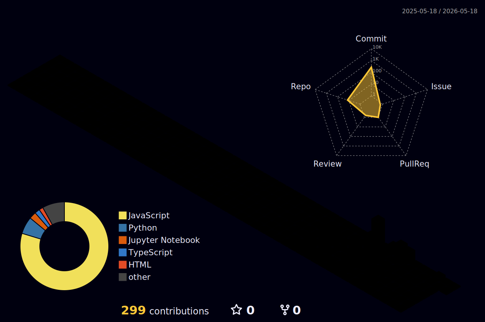

<h1 align="center">Hi 👋, I'm Harsh Tevatia</h1>
<h3 align="center">Full Stack Developer | Building Premium Experiences</h3>

---

## 🚀 About Me
- 🔭 Currently working on WebApps
- 🌱 Learning : Full Stack Development
- 💬 Ask me about : Building scalable full-stack apps with Next.js & MongoDB 
- ⚡ Fun fact : I don't ship average — I ship polished.

---
## 🏙️ 3D Contribution Graph

  

---

## 🛠 Tech Stack

---

## 📊 GitHub Analytics

  
  

  

## 🔥 Contribution Graph

---

## 🐍 Contribution Snake

---

## 🌐 Connect With Me

